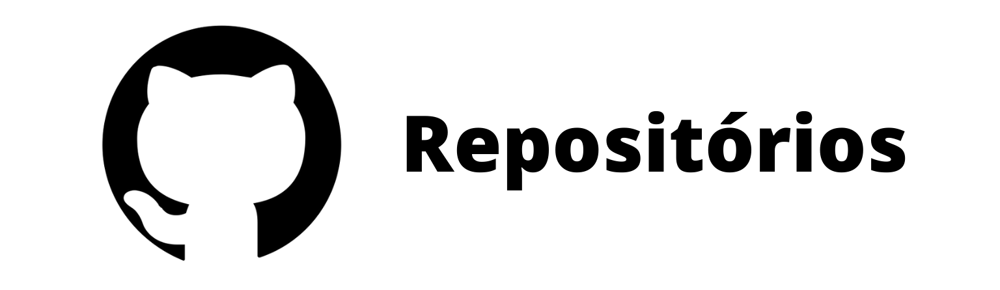
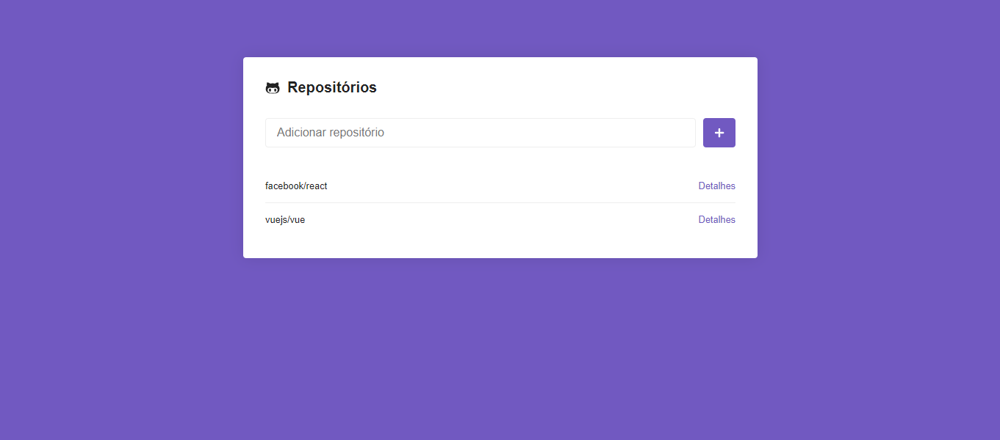
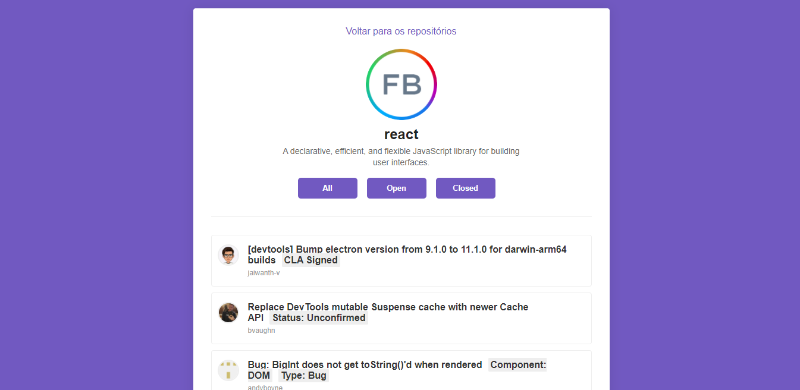

<p align="center">
  
</p>
<p align="center">
   
   
</p>

# :pushpin: Table of Contents

* [Features](#rocket-features)
* [Installation](#construction_worker-installation)
* [FAQ](#postbox-faq)

# :rocket: Features
* Search repositories in the Github REST API
* Save repository to localStorage
* Route to the repository page
* Show information about the repository such as: name, logo, issues
* Filter of issues according to their status which are: all, open and closed.
* Pagination of issues

# :construction_worker: Installation

**You need to install [Node.js](https://nodejs.org/en/download/) and [Yarn](https://yarnpkg.com/) first, then in order to clone the project via HTTPS, run this command:**

```
git clone https://github.com/lzhudson/challenge-05-reactjs.git
```

**Install dependencies**

```
yarn
```

**Start development server**

```
yarn start
```
# :postbox: Faq

**Question:** What are the technologies used in this project?

**Answer:** [React](https://pt-br.reactjs.org/)

**Question** What other tools were used to build the application?

**Answer:**

- [React Router](https://reactrouter.com/)
- [Styled Components](https://styled-components.com/)
- [Axios](https://github.com/axios/axios)
- [React Icons](https://react-icons.github.io/react-icons/)

Made with love by [Hudson Holanda](https://github.com/lzhudson) 💜🚀
